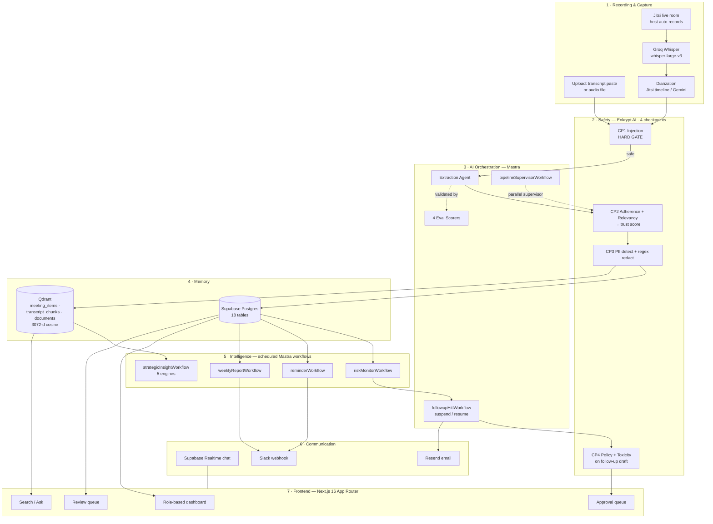
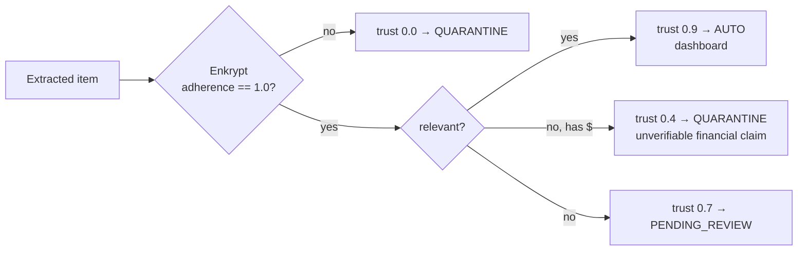
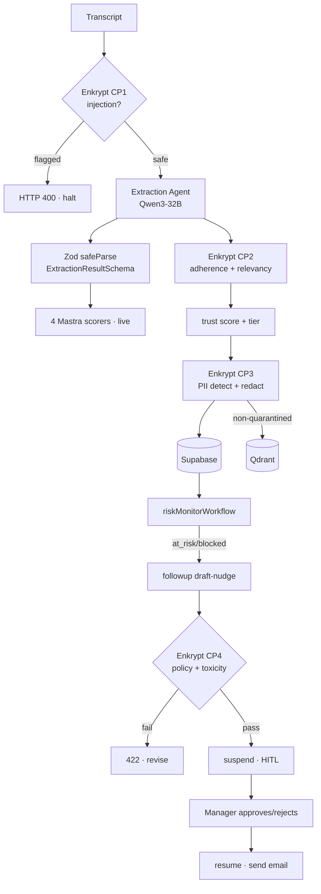
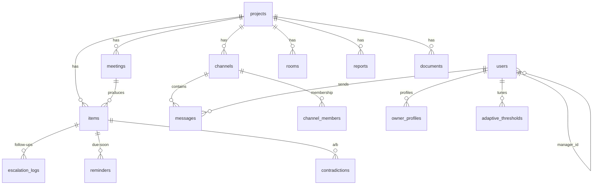

# Helm — AI Chief of Staff & Meeting Command Center

**HiDevs × Mastra AI Agent Hackathon 2026 — Technical Documentation**

> Track: *AI Meeting Intelligence & Action Command Center*
> Team: 2 members — Member 1 (backend, AI pipeline, database) · Member 2 (frontend, UI/UX)
> Stack: Next.js 16 (App Router) · Mastra · Qdrant · Enkrypt AI · Supabase · Featherless · Gemini · Groq

> **A note on accuracy for the judges.** Every claim in this document is grounded in the actual source tree (file paths are cited inline). Where our shipped implementation differs from a common assumption — e.g. we generate text on **Featherless / Qwen3-32B**, not Gemini Flash; we run **Next.js 16.2.9**, not 15 — we document the reality and explain the engineering reason. Features that are scaffolded but not fully closed-loop are explicitly marked **Designed / Partial**. Nothing here is aspirational.

---

## SECTION 1 · PROJECT OVERVIEW

**Helm** is an AI Chief of Staff that sits on top of a team's meetings and turns talk into tracked, trustworthy, executed work. It ingests a meeting (live-recorded or uploaded), extracts every decision and action item, **scores how much each extraction can be trusted**, remembers everything as vectors for cross-meeting reasoning, autonomously monitors commitments for risk, and drafts follow-up nudges that a human approves before anything is ever sent.

**Elevator pitch.** Teams/Zoom/Otter stop at a transcript and a summary. They tell you *what was said*. They never tell you *what was decided, who owns it, whether the AI hallucinated it, whether it's now overdue, or whether it contradicts a decision from three meetings ago* — and they certainly don't chase it down. Helm is built for the gap **after** the summary: follow-through, trust, cross-meeting intelligence, and human-in-the-loop autonomy. Every extracted item carries a visible trust score from a 4-checkpoint Enkrypt safety pipeline; every follow-up passes a policy gate and waits for human approval; every decision is embedded in Qdrant so the system can catch contradictions and answer "why did we switch databases?" with citations.

**The core loop:**

```
Extract  →  Validate  →  Remember  →  Monitor  →  Act (with human approval)
(agent)     (Enkrypt)     (Qdrant)     (workflow)   (HITL suspend/resume)
```

---

## SECTION 2 · PROBLEM STATEMENT

> **"Build an AI-powered meeting intelligence system that processes meeting recordings or transcripts, automatically extracts decisions, action items, deadlines, and assignees, and converts them into structured tasks…"**

Existing tools fail at four specific things:

1. **They stop at summarization.** A summary is a dead artifact. It doesn't become a task, doesn't get an owner, doesn't get a deadline you can query, and doesn't get chased.
2. **They don't track execution.** Once the meeting ends, the tool forgets. Nobody knows an action item is overdue until a human notices.
3. **They don't validate their own outputs.** LLM summarizers hallucinate owners, invent deadlines, and fabricate "$50k budget approved" lines with total confidence and zero provenance. There is no trust signal.
4. **They don't reason across meetings.** A decision made today that reverses one from last month sails through silently. No contradiction detection, no memory.

**The gap Helm fills:**

| Missing capability | How Helm closes it |
|---|---|
| Follow-through | Rule-based risk monitor + HITL follow-up drafting + escalation queue |
| Trust | 4 Enkrypt checkpoints → per-item trust score → 3-tier routing (auto / review / quarantine) |
| Cross-meeting intelligence | Qdrant vector memory → contradiction detection, dependency resolution, cited Q&A |
| Human-in-the-loop autonomy | Mastra `suspend()/resume()` — nothing is sent without a human tap |

---

## SECTION 3 · SOLUTION OVERVIEW

### End-to-end pipeline (`app/api/pipeline/route.ts`)

The production ingestion pipeline runs as **deterministic, sequential, instrumented code** — a decision explained in §5.6 and §15. Each numbered step is a real function call in the route handler:

1. **Recording / upload.** Live meetings run in a Jitsi room (`app/rooms/[id]`); the host's browser records audio hands-free. Alternatively a transcript is pasted or an audio file dropped at `/upload`.
2. **Transcription — Groq Whisper.** `whisper-large-v3`, `verbose_json` with segment timestamps (`transcribeAudio()`). Speaker labels come from the live Jitsi `dominantSpeakerChanged` timeline (free, deterministic) with a Gemini audio-diarization fallback (`lib/diarize.ts`).
3. **Enkrypt Checkpoint 1 — injection screening (HARD GATE).** `runInjectionCheck()` calls Enkrypt `injection_attack` on the raw transcript **before any LLM sees it**. A flagged transcript halts the pipeline with HTTP 400.
4. **Extraction (Mastra Agent).** The Extraction Agent turns transcript text into structured JSON items. Output is stripped of reasoning tokens and brace-extracted, then `.safeParse()`d against the shared Zod schema.
5. **Structured extraction.** decisions, action items, `deadline.raw`/`resolved_iso`, `dependency_hints`, `supersedes_hint`, verbatim `source_quote`, `source_timestamp`, owner (resolved from speaker labels).
6. **Enkrypt Checkpoint 2 — adherence + relevancy.** For each item, Enkrypt `adherence` (is the item grounded in its source quote?) and `relevancy` (is it on-topic?) produce a trust score.
7. **Trust score + 3-tier routing.** `> 0.85 → auto` (dashboard), `0.60–0.85 → pending_review`, `< 0.60 → quarantined`.
8. **Enkrypt Checkpoint 3 — PII.** `enkryptPiiCheck()` (Enkrypt PII detector with an explicit entity list) as the detection signal + a deterministic regex redactor (`redactPII()`) as the actual redaction mechanism, run **before** any data reaches storage.
9. **Storage.** Structured rows → Supabase Postgres; embeddings → Qdrant (`meeting_items`). Quarantined items are written to Postgres for human triage but **never** embedded into Qdrant.
10. **Dashboard population.** Trust-scored items surface on the role-appropriate dashboard.
11. **Scheduled risk monitoring.** `riskMonitorWorkflow` applies dependency / deadline / silence rules and transitions items to `blocked` / `at_risk`.
12. **Follow-up drafting + Enkrypt Checkpoint 4.** `followupHitlWorkflow` drafts a tiered nudge, then runs Enkrypt `policy_violation` + `toxicity` on the draft (hard gate).
13. **Human-in-the-loop approval queue.** The workflow `suspend()`s; `/followups` shows the draft; approve/reject `resume()`s it.
14. **Notification delivery.** Approved follow-ups are emailed (Resend, `lib/mailer.ts`); reminder & weekly-report workflows post to Slack.

### Role-based experience

`app/lib/useRole.ts` drives two distinct products from one codebase: **employees** see a personal task workspace and a simplified nav; **managers/VPs** see team analytics, the review queue, the approval queue, and admin/intelligence settings (`useManagerGuard`).

### Getting smarter over time

Every extraction runs the 4 Mastra eval scorers live (`scoreExtraction()`), the review queue captures human accept/edit/discard decisions on low-trust items, and `owner_profiles` / `adaptive_thresholds` / `audit_logs` tables provide the scaffolding for adaptive thresholds (see §18 for what is closed-loop vs. designed).

---

## SECTION 4 · FULL SYSTEM ARCHITECTURE



**Layer walk-through.**

- **Recording & Capture** — a live Jitsi room records the host's audio hands-free and captures a speaker timeline; Groq Whisper transcribes; diarization labels segments deterministically from the Jitsi timeline (zero model cost) or falls back to a Gemini audio guess.
- **Safety (Enkrypt, 4 checkpoints)** — wraps the entire pipeline: CP1 gates the raw transcript, CP2 scores every extraction, CP3 detects/redacts PII, CP4 gates every outbound follow-up. Two of the four (CP1, CP4) are **hard gates** that halt the flow.
- **AI Orchestration (Mastra)** — the Extraction Agent, a registered supervisor workflow that re-implements the pipeline as explicit Mastra steps, 4 deterministic eval scorers, and the HITL follow-up workflow with real `suspend()/resume()`.
- **Memory (Qdrant + Supabase)** — Qdrant holds three 3072-dim collections for semantic recall; Supabase holds the structured system of record (18 tables) and powers Realtime.
- **Intelligence (scheduled workflows)** — four Mastra workflows that run risk monitoring, deadline reminders, weekly reporting, and five strategic-insight engines.
- **Communication** — Supabase Realtime for chat, Resend for email, Slack webhooks for digests.
- **Frontend** — a Next.js 16 App Router UI with role-based views, review/approval queues, and semantic search.

**Trust routing (implemented in `scoreTrustItems()`):**



---

## SECTION 5 · MASTRA INTEGRATION  *(25% weight — most detailed section)*

Helm's Mastra usage is **load-bearing and idiomatic**, not a wrapper. The deployed Next.js app constructs a real `Mastra` instance (`lib/mastra/index.ts`) that registers **6 workflows, 2 agents, and 4 scorers**, backed by a **LibSQL store** for run persistence and observability. API routes execute these via the canonical `mastra.getWorkflow(id).createRun().start()` idiom, and the follow-up flow uses genuine `suspend()/resume()` human-in-the-loop.

```ts
// lib/mastra/index.ts  (verbatim shape)
export const mastra = new Mastra({
  workflows: {
    riskMonitorWorkflow, followupHitlWorkflow, reminderWorkflow,
    weeklyReportWorkflow, strategicInsightWorkflow, pipelineSupervisorWorkflow,
  },
  agents:  { followupAgent, extractionAgent },
  scorers: { itemCountScorer, ownerAccuracyScorer, typeAccuracyScorer, sourceQuotePresenceScorer },
  storage: new LibSQLStore({ id: "helm-mastra", url: dbUrl }),
});
```

**Packages:** `@mastra/core ^1.48.0`, `@mastra/libsql ^1.15.1`, `@mastra/qdrant ^1.1.0`.

### 5.1 Agents

| Agent | File | Model | Purpose |
|---|---|---|---|
| **Extraction Agent** | `lib/mastra/agents/extraction-agent.ts` | `generationModel` (Featherless `Qwen/Qwen3-32B`) | Transcript → structured `{ items: [...] }` JSON |
| **Follow-up Agent** | `lib/mastra/agents/followup-agent.ts` | `generationModel` (Featherless `Qwen/Qwen3-32B`) | Drafts a tiered 2–3 sentence follow-up nudge |

> **Model note:** `generationModel` is defined in `lib/model.ts` as an OpenAI-compatible Featherless provider (`Qwen/Qwen3-32B`). Gemini's free tier proved unworkable for text generation (404 on new keys for 2.5-flash, `limit:0` on 2.0-flash, 20 req/day on flash-latest), so **generation migrated to Featherless** while **Gemini is retained for embeddings and audio diarization** — a separate quota bucket. Mastra's `Agent.model` accepts any AI-SDK `LanguageModel` instance directly, which made this a one-line provider swap with zero workflow changes.

**Extraction Agent.**
- *Does:* reads a transcript (formatted `[MM:SS] Speaker: text`), extracts every decision and action item, resolves first-person pronouns to speaker names, and returns JSON.
- *System prompt (summary):* extract even hedged/secondhand commitments; never invent people or numbers; `source_quote` is mandatory and verbatim; omit unknown fields rather than guessing; output only JSON.
- *Tools:* none (single-shot structured generation — deliberate, see §5.6).
- *I/O schema:* input = transcript string; output validated against `ExtractionResultSchema` (`lib/mastra/schemas/item.schema.ts`).
- *Pipeline role:* the single LLM reasoning step in ingestion; also invoked inside `pipelineSupervisorWorkflow`'s `extract` step and the eval runner.

> The production `/api/pipeline` route also instantiates an inline Extraction Agent with a richer prompt (speaker-label pronoun resolution, retry/backoff on 429) — same Mastra `Agent` class — because cross-package imports from the standalone Mastra project aren't supported at runtime. The registered agent is the canonical, eval-covered version.

**Follow-up Agent.**
- *Does:* given item text, owner, deadline, days overdue, and tier, writes a friendly-but-clear nudge, addressed by name, under 3 sentences, no subject line, no placeholders.
- *Pipeline role:* step 1 of `followupHitlWorkflow`.

### 5.2 Workflows

All six are real `createWorkflow(...).then(step).commit()` graphs built from `createStep`. Registered and executed live from API routes.

| Workflow | File | Trigger (route) | HITL |
|---|---|---|---|
| `followupHitlWorkflow` | `workflows/followup-hitl-workflow.ts` | `POST /api/followup/draft` → `…/resolve` | **Yes — suspend/resume** |
| `riskMonitorWorkflow` | `workflows/risk-monitor-workflow.ts` | `POST /api/risk-scan` | No |
| `reminderWorkflow` | `workflows/reminder-workflow.ts` | `POST /api/reminders/trigger` | No |
| `weeklyReportWorkflow` | `workflows/weekly-report-workflow.ts` | `POST /api/reports/weekly/generate` | No |
| `strategicInsightWorkflow` | `workflows/strategic-insight-workflow.ts` | `GET /api/dashboard/insights` | No |
| `pipelineSupervisorWorkflow` | `workflows/pipeline-supervisor-workflow.ts` | `POST /api/pipeline/supervise` | No |

**`followupHitlWorkflow` — the HITL showcase (3 steps).**
1. `draft-nudge` — Follow-up Agent generates the message (Qwen3 `/no_think` mode + `stripReasoning()` so no chain-of-thought leaks into email).
2. `policy-check` — **Enkrypt Checkpoint 4:** `POST /guardrails/detect` with `policy_violation` (a real `policy_text` conduct standard) + `toxicity`. Returns `policy_passed`; the toxicity array is handled correctly (`[] = clean`), and the step *fails closed* on any Enkrypt error.
3. `human-approval` — calls `suspend({ message, draft, owner, item_text, policy_passed })` and **stops**. `run.start()` returns to `/api/followup/draft`, which persists the draft to `escalation_logs` and keeps the live `Run` object in an in-memory `followupRuns` map keyed by `escalation_id`. When a manager approves at `/followups`, `/api/followup/resolve` calls `run.resume({ step: "human-approval", resumeData: { approved } })` on the exact suspended run. **Nothing is sent without this human tap.**

> **Honest deployment caveat (documented, not hidden):** `/api/followup/draft` and `/api/followup/resolve` are separate serverless invocations with no shared memory, and LibSQL's file store is ephemeral on Vercel. So cross-invocation resume-from-storage is unreliable there; the in-memory fast path works within a warm instance, and **the approval decision is always durably recorded in `escalation_logs` and the email sent regardless** of whether `resume()` reconnects. The suspend/resume machinery is genuine Mastra HITL; the durability of the *decision* does not depend on it.

**`pipelineSupervisorWorkflow` — supervisor-orchestrating-specialists (5 steps):** `extract` (agent) → `validate-schema` (Zod `.safeParse`) → `trust-score` (Enkrypt adherence + relevancy per item) → `pii-check` (Enkrypt PII detector) → `eval-score` (the 4 Mastra scorers). This is the reasoning/validation supervisor, registered and callable, running independently of the write-path pipeline.

**`riskMonitorWorkflow` (2 steps):** `fetch-items` (high-trust, non-done action items + a global status map) → `evaluate-and-apply`. Three rules: **(1)** blocked by an open dependency (`depends_on` where target ≠ done), **(2)** deadline overdue or ≤3 days out, **(3)** silence — no activity ≥5 days with deadline ≤7 days out. Applies status transitions and records plain-language reasons.

**`reminderWorkflow` (2 steps):** `find-due-items` (open items due within 2 days) → `create-reminders` (24h dedup, insert `reminders` rows, email owners via Resend, post a Slack summary).

**`weeklyReportWorkflow` (2 steps):** `aggregate-week` (7-day rollup: meetings, completed/pending/at-risk counts, major decisions, per-meeting ROI, persisted to `reports`) → `notify-slack`.

**`strategicInsightWorkflow` (7 steps):** a `seed` step, then one step per **engine** — `decision-velocity`, `recurring-blocker` (embeds dependency hints and clusters by >0.8 cosine), `commitment-drift`, `meeting-roi`, `cross-project` (embeds recent decisions and does a **cross-project Qdrant search** for >0.88 parallels) — then `sort-signals` by severity. Each engine step appends to a carried accumulator and is individually try/catch-isolated.

### 5.3 Tools

**Deliberate architectural choice: the production pipeline uses no dynamic tool-calling.** The write-path (`/api/pipeline`) is fixed sequential code, and the registered workflows compose behaviour through **`createStep` primitives** rather than agent-selected tools. This is intentional (see §5.6 / §15): the pipeline order is known ahead of time, and open-weight models were unreliable at dynamic tool selection. The "tools" of the system are therefore expressed as workflow steps (extract, validate, trust-score, pii-check, eval-score, draft, policy-check, human-approval, fetch-items, evaluate-and-apply, etc.), each with its own Zod input/output schema — a more deterministic and testable composition than free-form function-calling.

### 5.4 Evals / Scorers

Four deterministic scorers built with Mastra's `createScorer` (`lib/mastra/scorers/extraction-scorers.ts`), each a `.preprocess() → .generateScore() → .generateReason()` pipeline. They run **live in the ingestion pipeline** (`scoreExtraction()` is called on every extraction) and on demand via `POST /api/evals/run` against a golden transcript.

| Scorer | Measures | Scoring |
|---|---|---|
| `extraction-item-count` | Count vs golden set | 1.0 exact · 0.8 ±1 · 0.5 ±2 · else 0 |
| `extraction-owner-accuracy` | Owner correct on best-matched items | correct / total (Jaccard word-overlap matching) |
| `extraction-type-accuracy` | decision vs action_item correctness | correct / total |
| `extraction-source-quote-presence` | Fraction of items carrying a verbatim `source_quote` | withQuote / total — **directly backs Enkrypt adherence** |

Each scorer emits a human-readable `reason` (e.g. *"2/3 owners correct. Missing: Priya on 'ship the API…'"*), giving explainable QA rather than a bare number.

### 5.5 Mastra Configuration

- **Initialization:** `new Mastra({ workflows, agents, scorers, storage })` in `lib/mastra/index.ts`.
- **Model provider:** AI-SDK `LanguageModel` instances from `lib/model.ts` — Featherless (OpenAI-compatible) for generation; `@ai-sdk/google` embeddings elsewhere.
- **Registration:** all workflows/agents/scorers are passed to the constructor and each workflow `.commit()`s its graph.
- **Storage / observability:** `LibSQLStore` persists workflow runs and suspended HITL state (`file:./helm-mastra.db` locally, `file:/tmp/helm-mastra.db` on Vercel — the read-only bundle nuance is handled explicitly). Separately, `lib/observability.ts` provides OpenTelemetry-style LLM tracing (`withLLMTrace`) surfaced at `/observability`.
- **HITL implementation:** `suspend()/resume()` in `followupHitlWorkflow` + the in-memory `followupRuns: Map<string, FollowupRun>` fast path.

### 5.6 Why Mastra (not just "we used it")

- **Human-in-the-loop is a first-class primitive.** `suspend()/resume()` let a workflow pause mid-graph for a human decision and resume the *exact* run later. Re-implementing durable, resumable, mid-workflow suspension by hand is exactly the kind of infrastructure Mastra exists to remove.
- **Typed step composition.** `createStep` with Zod input/output schemas gives every stage a validated contract; graphs are `.then()`-chained and `.commit()`ed. Six workflows share this idiom.
- **Evals as production code.** `createScorer` runs the *same* scorers in CI-style eval runs and live in the pipeline — quality is measured continuously, not once.
- **Provider-agnostic agents.** `Agent.model` takes any AI-SDK model, which is precisely why our forced Gemini→Featherless generation migration was a one-liner.
- **Beyond wrapper calls:** we register agents, workflows, scorers, and a persistent store; we run real suspend/resume HITL; and we deliberately chose deterministic step composition over agentic tool-calling after observing open-weight models fabricate tool-call success — a conclusion only reachable by actually building the agentic version first.

---

## SECTION 6 · QDRANT INTEGRATION  *(20% weight)*

Qdrant is Helm's **long-term semantic memory** and the substrate for everything cross-meeting: search, cited Q&A, dependency resolution, contradiction detection, and two strategic-insight engines. We use both `@mastra/qdrant` (`QdrantVector`) for upserts/collection management **and** raw Qdrant REST for payload-filtered search (which the SDK doesn't expose) — a pragmatic hybrid.

### 6.1 Collection schema

Three collections, all **3072-dimensional, cosine** (matching `gemini-embedding-001`):

| Collection | Holds | Key payload fields |
|---|---|---|
| `meeting_items` (env `QDRANT_COLLECTION`, default `meeting_items`) | One vector per non-quarantined extracted item | `item_id, text, type, meeting_id, meeting_title, owner, trust_score, review_state, project_id, supersedes_hint` |
| `transcript_chunks` | Speaker-turn / ~45s transcript windows | `chunk_text, meeting_id, meeting_title, chunk_index, start_time, end_time, project_id` |
| `documents` | Uploaded project documents (chunked) | `chunk_text, document_name, project_id` |

*Why this schema:* items carry `trust_score`/`review_state` so search can **exclude quarantined hallucinations at query time**; `project_id` enables tenant-scoped filtering and cross-project analysis; `meeting_title`/`source` fields let the ask-agent cite provenance; `supersedes_hint` supports decision-chain reasoning.

### 6.2 Embedding pipeline

- **Chunking (`chunkTranscript()`):** splits by speaker turn / 45-second windows, capped at 6 lines per chunk; gracefully degrades to pure line-count grouping when a transcript has no `[MM:SS]` markers. Returns `{ text, startTime, endTime }`.
- **Generation:** `google.textEmbeddingModel("gemini-embedding-001")` via AI-SDK `embed` / `embedMany`, wrapped in `withLLMTrace` for latency/token telemetry.
- **Upsert:** items are embedded as `"[type] text (owner: …)"` and upserted with `qdrant.upsert({ indexName, vectors, metadata })`; `transcript_chunks` is created on demand (`createIndex({ dimension: 3072, metric: "cosine" })`, idempotent).
- **Safety invariant:** quarantined items (`review_state === "quarantined"`) are filtered out **before** embedding — a low-trust hallucination can never enter the vector store.

### 6.3 Search & retrieval

`app/api/search/route.ts` embeds the query once and searches **all three collections in parallel** (`searchBothCollections`), then merges and re-ranks by score:

```ts
qdrantRawSearch("meeting_items", embedding, 8, {
  must_not: [{ key: "review_state", match: { value: "quarantined" } }],
});      // + transcript_chunks (5) + documents (4), all in Promise.all
```

- **Payload filters:** `must_not` review_state (exclude quarantine), `must` `project_id` (dependency resolution), used via raw REST because `@mastra/qdrant` lacks a filter API.
- **Graceful degradation:** if a keyword index isn't built yet (`400 Index required`), the code falls back to unfiltered search + JS post-filtering; `404` (collection absent on first run) returns `[]` instead of throwing.
- **Two modes:** `search` returns ranked raw results; `ask` retrieves top-5 context and generates a grounded, **cited** answer (see §6.4).

### 6.4 Cross-meeting intelligence

- **Contradiction detection (`detectContradictions()`):** for each new decision, embed it and Qdrant-search `meeting_items`; a >0.85-similar decision from a *different* meeting is written to the `contradictions` table. Explicit `supersedes_hint` phrases are embedded and matched to the overturned decision ("X supersedes Y").
- **Dependency resolution (`resolveDependencies()`):** each `dependency_hint` is embedded and Qdrant-searched (filtered by `project_id`); matches >0.7 (excluding self) populate the item's `depends_on` UUID array — which the risk monitor then uses for the "blocked" rule.
- **Cited Q&A (ask mode):** the knowledge assistant answers **only** from retrieved context, cites inline with `[Meeting Title]`, flags superseded decisions, and refuses to fabricate when context is thin. Reasoning tokens are stripped via `stripReasoning()`.
- **Strategic engines on Qdrant:** `recurring-blocker` clusters dependency-hint embeddings (>0.8 cosine); `cross-project` finds >0.88 parallels in *other* projects' decisions.

### 6.5 Why Qdrant

Traditional SQL `LIKE`/full-text can't answer "why did we switch databases?", can't tell that "move off Mongo" and "adopt Postgres" are the same commitment, and can't spot that today's decision contradicts one from a different meeting. Every one of Helm's differentiators — cited Q&A, contradiction detection, semantic dependency linking, cross-project insight — is a **vector-similarity** operation. Qdrant gives us named payload filters (trust/project scoping at query time), on-the-fly collection creation, and a REST API clean enough to drop to when the SDK abstraction is too narrow.

---

## SECTION 7 · ENKRYPT AI INTEGRATION  *(20% weight)*

Enkrypt is Helm's **safety spine** — four checkpoints wrapping the pipeline end to end, two of them hard gates. This is what makes every extracted item carry a *visible, earned* trust score instead of black-box confidence. Base URL `https://api.enkryptai.com`, `apikey` header (`enkryptPost()` helper surfaces the full error body, not just the status — critical for debugging detector-config errors).

### 7.1 All safety checkpoints

| # | Checkpoint | Detector / endpoint | Location | On flag |
|---|---|---|---|---|
| **1** | Prompt-injection | `injection_attack` → `/guardrails/detect` | `runInjectionCheck()`, before any LLM | **HARD GATE — HTTP 400, pipeline halts** |
| **2** | Adherence + Relevancy | `/guardrails/adherence` + `/guardrails/relevancy` | `scoreTrustItems()`, per item | Drives trust score → tier routing |
| **3** | PII | `pii` (+ explicit `entities`) → `/guardrails/detect` | `enkryptPiiCheck()` + `redactPII()` | Detect + regex-redact before storage |
| **4** | Policy + Toxicity | `policy_violation` (+ `policy_text`) + `toxicity` → `/guardrails/detect` | `followupHitlWorkflow` policy-check step | **HARD GATE — draft blocked from queue** |

**Checkpoint 1 — Injection (hard gate).** Runs on the raw transcript *before extraction*. `summary.injection_attack === 1` → the route returns `{ halted: true, confidence }` and nothing downstream ever sees the transcript.

**Checkpoint 2 — Trust scoring.** Per item: adherence (`context` = the transcript line containing the `source_quote`, `llm_answer` = item text) and relevancy (against "what decisions/action items were discussed in <title>?"). The exact tiering:

```ts
const hasFinancialClaim = /\$\d/.test(item.text);
const trust_score = !adherent ? 0.0
  : relevant ? 0.9
  : hasFinancialClaim ? 0.4   // adherent but off-topic AND a dollar figure
  : 0.7;
const review_state = trust_score >= 0.85 ? "auto"
  : trust_score >= 0.6 ? "pending_review" : "quarantined";
```

The killer demo case: a fabricated **"$50k budget approved"** with no grounding scores `adherence 0 → 0.0 → quarantined`, and (being quarantined) is **never embedded into Qdrant**, so it can't even leak into search. Real per-check scores are stored in the item's `enkrypt_checks` JSON for the trust-detail endpoint.

**Checkpoint 3 — PII.** Enkrypt's PII detector requires an explicit entity list (`PERSON, EMAIL_ADDRESS, PHONE_NUMBER, CREDIT_CARD, US_SSN, IP_ADDRESS, IBAN_CODE, US_PASSPORT, LOCATION`) — omitting it 400s with *"Missing pii.entities"*. Enkrypt is the authoritative **detection** signal; a deterministic regex redactor (`redactPII()` — PAN, cards, Aadhaar, email, phone) does the actual **redaction** (it knows *where*), running before any data reaches Supabase or Qdrant.

**Checkpoint 4 — Follow-up policy (hard gate).** Every AI-drafted nudge is screened against a `policy_text` conduct standard (no harassment, threats, insults, discriminatory language, or leaked contact details/credentials) plus toxicity. `policy_passed = policyOk && toxicityOk`; the toxicity response is an **array** (`[] = clean`), handled correctly; a failing draft returns HTTP 422 and never reaches the approval queue.

### 7.2 Trust score system

- **Computed** from Enkrypt adherence + relevancy (+ a financial-claim guard), per §7.1.
- **3-tier routing:** `auto` (≥0.85 → dashboard), `pending_review` (0.60–0.85 → `/review`), `quarantined` (<0.60 → `/review` red band, excluded from Qdrant).
- **Displayed** as colored trust badges throughout the UI (green >0.85, amber 0.60–0.85, red <0.60), with a per-item trust-detail endpoint (`/api/items/[id]/trust`) surfacing the real `enkrypt_checks` breakdown.

### 7.3 Fallback mechanisms

- **PII 400 (`Missing pii.entities`)** — root cause fixed by sending the entity list; if the call still errors, `enkryptPiiCheck()` catches, logs the full body, and the **local regex redactor remains the safety net** (fails safe, not open).
- **Checkpoint 4 fail-closed** — if Enkrypt is unreachable during policy check, `policy_passed` defaults to `false` so a human still reviews.
- **Trust scoring resilience** — an Enkrypt error while scoring an item logs and leaves that item's score at 0 (→ quarantine), never silently promoting an unscored item.

### 7.4 Why Enkrypt AI

Meeting AI that invents "$50k approved" or a fake owner is worse than no AI — it manufactures false confidence. Enkrypt lets Helm show a **visible, earned trust score** on every item and physically quarantine anything unsupported. The quarantine/review workflow builds user trust precisely because the system is transparent about its own uncertainty: humans see *why* an item was flagged (the `enkrypt_checks` breakdown), correct it, and that correction becomes eval signal. Hard gates on ingestion (injection) and egress (policy) mean the two highest-risk surfaces — untrusted input and outbound messages — are never left to model goodwill.

---

## SECTION 8 · AI WORKFLOW & AGENT ARCHITECTURE



- **Supervisor pattern.** `pipelineSupervisorWorkflow` is the explicit supervisor-orchestrating-specialists implementation (extract → validate → trust → PII → score). The production write-path deliberately runs the same stages as **deterministic code** for reliability (§5.6); both coexist and are registered.
- **Delegation & communication.** Steps pass a typed carry-object down the `.then()` chain; the extraction step's JSON output feeds validation, scoring, and eval simultaneously.
- **Error handling.** Extraction retries on 429 with backoff and fails fast on daily-quota exhaustion; each strategic-insight engine is try/catch-isolated; Enkrypt failures fail *safe*; Qdrant index/collection-absence errors degrade gracefully.
- **HITL.** `suspend()` freezes the follow-up mid-workflow with the drafted payload; the live `Run` is held in `followupRuns`; `resume({ approved })` completes it — and the decision is durably logged either way.

---

## SECTION 9 · DATABASE DESIGN

Supabase Postgres is the structured system of record. **Core tables** predate the hackathon extensions; **extended tables** are created by the idempotent DDL in `app/api/setup-db/route.ts` (`CREATE TABLE IF NOT EXISTS` + `ALTER … ADD COLUMN IF NOT EXISTS`).



**Core tables**

| Table | Key columns | Purpose |
|---|---|---|
| `projects` | id, name, description | Workspace / tenant |
| `users` | id, name, email, role (employee/manager/vp), manager_id→users | Org hierarchy |
| `meetings` | id, project_id, title, date, source_type (live/upload), transcript_text | Meeting record |
| `items` | id, meeting_id, project_id, type, text, owner, **owner_id, owner_email**, deadline_raw, deadline_iso, status, **trust_score, review_state, review_reason**, source_quote, source_timestamp, dependency_hints, depends_on (uuid[]), supersedes_hint, supersedes_id, **enkrypt_checks (jsonb)**, followup_sent_at, created_at, updated_at | Decisions & action items — the heart of the system |
| `escalation_logs` | id, item_id, tier, drafted_text, status (pending/approved/sent/rejected/flagged), **policy_passed, run_id**, resolved_at, created_at | Follow-up drafts + HITL decisions |
| `contradictions` | id, item_a_id, item_b_id, description, created_at | Cross-meeting conflicts |

**Extended tables** (`setup-db`): `rooms`, `channels`, `channel_members`, `messages` (Realtime), `documents`, `reports`, `reminders`, `owner_profiles`, `audit_logs`, `adaptive_thresholds`, `project_briefs`, `agent_prompts`.

- **Realtime:** `messages` powers live chat via Supabase Realtime subscriptions (`postgres_changes` INSERT on `messages`).
- **RLS:** the app authenticates via Supabase Auth; API routes use the service-role key server-side and the anon key client-side. Fine-grained RLS policies are **Designed / Partial** — access control is currently enforced at the role/route layer (`useManagerGuard`, manager-only endpoints).

---

## SECTION 10 · API SURFACE

~70 App Router route handlers. Grouped by domain (`ƒ` = dynamic server route).

**Auth** — `POST /api/auth/signup`, `/login`, `/logout`
**Pipeline (internal / ingestion)** — `POST /api/pipeline` (7-step ingest), `POST /api/pipeline/supervise` (Mastra supervisor workflow), `POST /api/transcribe`, `POST /api/meetings/record`, `POST /api/meetings/[id]/recording`
**Meetings** — `GET/POST /api/meetings`, `GET /api/meetings/[id]`
**Items** — `GET /api/items`, `GET/PATCH /api/items/[id]`, `POST /api/items/[id]/complete`, `GET /api/items/[id]/trust`
**Decisions / Contradictions** — `GET /api/decisions`, `GET /api/contradictions`
**Review (trust)** — `GET /api/review/queue`, `POST /api/review` (accept/edit/discard)
**Follow-ups (HITL)** — `POST /api/followup/draft`, `POST /api/followup/resolve`, `GET /api/followups/queue`
**Risk** — `POST /api/risk-scan` (risk workflow + auto-draft), `GET /api/risk/radar`
**Search** — `POST /api/search` (`mode: search | ask`)
**Dashboard / Reports** — `GET /api/dashboard/insights` (strategic workflow), `GET /api/dashboard/briefing`, `GET /api/reports/weekly`, `POST /api/reports/weekly/generate`
**Team** — `GET /api/team/status`
**Workflows (explicit triggers)** — `POST /api/workflows/{risk-monitor,followup,reminder,weekly-report,insights}`
**Reminders** — `GET/POST /api/reminders`, `PATCH /api/reminders/[id]`, `POST /api/reminders/trigger`
**Chat** — `GET/POST /api/channels`, `/api/channels/[id]/messages`, `/api/dms/[userId]`
**Rooms (Jitsi)** — `GET/POST /api/rooms`, `/api/rooms/[id]`, `POST /api/webhooks/jibri`, `/api/webhooks/external-completion`
**Calendar** — `GET /api/calendar`
**Projects / Docs / Brief** — `GET/POST /api/projects`, `/api/projects/[id]`, `/api/projects/[id]/documents`, `POST /api/projects/[id]/brief`
**Admin / Intelligence** — `/api/admin/{thresholds,thresholds/[id],learning,audit-log,prompts,prompts/[agentId]}`
**Integrations** — `/api/integrations`, `/api/integrations/[id]`, `…/mapping`, `…/test`
**Observability / Ops** — `GET /api/observability/traces`, `/api/observability/health`, `/api/settings/health`, `/api/compliance/status`, `/api/architecture`, `POST /api/evals/run`, `POST /api/setup-db`

Each returns JSON with explicit HTTP status codes; ingestion/search apply rate limiting and input sanitization (§14).

---

## SECTION 11 · FRONTEND ARCHITECTURE

**24 page routes** (Next.js 16 App Router, `app/**/page.tsx`), all dark-theme, role-aware.

| Route | Purpose |
|---|---|
| `/` | Role-based dashboard (metrics, signals, briefing, approval widget) |
| `/upload` | Transcript paste + audio drag-drop → pipeline |
| `/items`, `/items/[id]` | Kanban board (`@dnd-kit`) + item detail |
| `/decisions` | Decision log + supersede chains + contradiction alerts |
| `/meetings`, `/meetings/[id]` | Meeting list + transcript/items detail |
| `/review` | **Trust review queue** — accept/edit/discard + owner-conflict assignment |
| `/followups` | **Approval queue** — tiered drafts, policy badge, approve & send |
| `/search` | Search vs Ask (cited AI answers) |
| `/chat`, `/chat/[channelId]` | Realtime chat |
| `/calendar` | `react-big-calendar` — rooms + deadlines |
| `/team` | Manager/VP team status table |
| `/reports` | Weekly reports + meeting-ROI badges |
| `/rooms/new`, `/rooms/[id]` | Jitsi live rooms (auto-record) |
| `/workspace/[id]` | Project hub (overview/meetings/chat/docs/brief) |
| `/observability` | LLM trace viewer |
| `/settings`, `/settings/integrations`, `/settings/intelligence` | Workspace, integrations, adaptive-intelligence controls |
| `/login`, `/signup` | Supabase Auth (email confirmation) |

- **State:** React hooks + Supabase client; `useRole`/`useManagerGuard` gate views and routes.
- **Realtime:** `supabase.channel().on('postgres_changes', …)` on `messages`.
- **Design system:** graphite dark palette, iris accent, Space Grotesk / Inter / JetBrains Mono, colored trust & status badges, per-page skeleton/empty/error states, success toasts.
- **Libraries:** Next.js 16.2.9 (App Router, React 19), Tailwind CSS v4 (CSS-first `@theme`), `lucide-react`, `recharts`, `react-big-calendar` + `date-fns`, `@dnd-kit/*`, `@jitsi/react-sdk`.

---

## SECTION 12 · TECH STACK

| Layer | Technology | Purpose | Why chosen | Cost |
|---|---|---|---|---|
| Framework | Next.js 16.2.9 (App Router) + React 19 | Full-stack UI + API routes | One deploy for frontend + backend + Mastra runtime | Free (OSS) |
| Language | TypeScript 5 | Type safety end-to-end | Zod-typed contracts | Free |
| Agent framework | Mastra (`@mastra/core` 1.48, `libsql`, `qdrant`) | Agents, workflows, evals, HITL | First-class suspend/resume + scorers | Free (OSS) |
| Text generation | Featherless — `Qwen/Qwen3-32B` (`@ai-sdk/openai-compatible`) | Extraction, follow-ups, ask | Usable free-tier LLM after Gemini quota walls | Free tier |
| Embeddings | Google `gemini-embedding-001` (3072-d) | Vectorization | Separate quota bucket; matches Qdrant dim | Free tier |
| Diarization | Google Gemini (audio) | Speaker labels fallback | Only when Jitsi timeline absent | Free tier |
| Transcription | Groq `whisper-large-v3` | Audio → text + timestamps | Fast, generous free tier | Free tier |
| Vector DB | Qdrant Cloud | Semantic memory (3 collections) | Payload filters, cosine, REST | Free tier |
| Safety | Enkrypt AI Guardrails | 4 checkpoints + trust scores | Injection/adherence/relevancy/PII/policy | Free tier |
| Database / Auth / Realtime | Supabase (Postgres) | System of record + auth + chat | Postgres + Realtime + Auth in one | Free tier |
| Email | Resend | Follow-up + reminder delivery | 100/day free, no card | Free tier |
| Notifications | Slack Webhook | Digests | Simple, free | Free |
| Video | Jitsi (`@jitsi/react-sdk`) | Live meeting rooms | Free, embeddable, no keys | Free (OSS) |
| UI | Tailwind v4, lucide-react, recharts, react-big-calendar, @dnd-kit | Design system | Standard, well-supported | Free (OSS) |
| Hosting | Vercel + Railway | App + Mastra runtime | Free tiers | Free tier |

**Everything runs on free tiers / open source.**

---

## SECTION 13 · DEPLOYMENT ARCHITECTURE

- **Frontend + API + Mastra runtime:** Next.js on **Vercel** (`helm-gray.vercel.app`). The Next.js app embeds the full Mastra integration and all API routes.
- **Standalone Mastra project / playground:** **Railway** (`hidevs-production.up.railway.app`) — the source-of-truth Mastra project (agents/workflows/tools mirror the web app) for the Mastra dev playground and observability.
- **Database:** Supabase Cloud (Postgres + Auth + Realtime).
- **Vector DB:** Qdrant Cloud.

**How they connect:** the browser talks to Vercel; Vercel API routes call Supabase (service role), Qdrant (REST + SDK), Enkrypt, Featherless, Gemini, Groq, and Resend server-side.

**Environment variables (names only):**

```
NEXT_PUBLIC_SUPABASE_URL / SUPABASE_URL      # Supabase project URL (Next / Mastra)
NEXT_PUBLIC_SUPABASE_ANON_KEY / SUPABASE_ANON_KEY
SUPABASE_SERVICE_ROLE_KEY                    # server-side privileged access
NEXT_PUBLIC_SITE_URL                         # canonical origin for auth email links
QDRANT_URL / QDRANT_API_KEY / QDRANT_COLLECTION
FEATHERLESS_API_KEY / FEATHERLESS_MODEL      # text generation (Qwen3-32B)
GOOGLE_GENERATIVE_AI_API_KEY / GEMINI_MODEL  # embeddings + diarization
GROQ_API_KEY                                 # Whisper transcription
ENKRYPT_API_KEY                              # 4 safety checkpoints
RESEND_API_KEY / RESEND_FROM                 # email delivery
SLACK_WEBHOOK_URL                            # digest notifications
MASTRA_DB_URL                                # LibSQL run store (optional)
NEXT_PUBLIC_JITSI_DOMAIN                      # meeting host (default meet.jit.si)
```

---

## SECTION 14 · SECURITY & COMPLIANCE

- **Enkrypt 4-checkpoint pipeline** — injection (CP1) and policy/toxicity (CP4) are hard gates; adherence/relevancy (CP2) and PII (CP3) gate storage.
- **PII redaction** — Enkrypt detection + deterministic regex redaction (`redactPII()`) **before** data reaches Supabase or Qdrant; quarantined items never embedded.
- **Trust-score transparency** — every item exposes its `enkrypt_checks` breakdown; nothing is a black box.
- **Human-in-the-loop** — no follow-up leaves the system without an explicit manager approval (`suspend()/resume()`); the decision is durably logged.
- **RBAC** — `role` (employee/manager/vp) + `manager_id` hierarchy; `useManagerGuard` and manager-only endpoints; service-role key stays server-side.
- **Rate limiting** (`lib/security.ts`) — in-memory limiter; pipeline capped at 10 runs/min/client, search 60/min.
- **Input sanitization** — `sanitizeInput()` strips `<script>`, `javascript:`, and inline event handlers and caps length before any LLM call.
- **Security headers** (`securityHeaders()`) — `X-Content-Type-Options`, `X-Frame-Options: DENY`, HSTS, `X-XSS-Protection`, `Content-Security-Policy`.
- **Observability** — `withLLMTrace` records model, latency, tokens, prompt **hash** (never raw prompts), and status for every LLM call.

---

## SECTION 15 · KEY DESIGN DECISIONS

- **Featherless `Qwen3-32B` for generation (not Gemini Flash).** Gemini's free tier blocked us (404 on new keys for 2.5-flash, `limit:0` on 2.0-flash, 20 req/day cap on flash-latest). We migrated text generation to Featherless via `@ai-sdk/openai-compatible` — a one-line change thanks to Mastra's provider-agnostic `Agent.model`. We also add Qwen3's `/no_think` + `stripReasoning()` so chain-of-thought never leaks into answers or emails, and gateway-timeout risk drops.
- **`gemini-embedding-001` @ 3072-d.** `text-embedding-004` is discontinued; `gemini-embedding-001` is current, sits in a separate quota bucket from generation, and its 3072-d output defines the Qdrant collection dimension.
- **Deterministic pipeline over agentic tool-calling.** We built the LLM-orchestrated 7-tool supervisor first; open-weight models emitted malformed tool-calls or fabricated success (200 response, zero rows written). The step order is known ahead of time, so we run it as sequential, instrumented code and keep the *reasoning* supervisor as a registered Mastra workflow. Reliability > cleverness.
- **Supabase over Firebase.** Real Postgres (joins, `uuid[]`, JSONB), Auth, and Realtime in one free service — a document store would have fought our relational item/dependency/contradiction model.
- **Jitsi for meetings.** Free, embeddable, no API keys, and exposes a `dominantSpeakerChanged` timeline we use for zero-cost deterministic diarization.
- **Zod schemas with optional fields.** `owner`/`deadline`/`dependency_hints` are optional and the prompt says "omit if not stated" — the model can't be forced to hallucinate a required field it doesn't have.
- **Trust tiers, not binary pass/fail.** Three tiers (auto/review/quarantine) route ambiguous items to humans instead of silently accepting or dropping them.
- **HITL on all follow-ups.** Outbound messages are the highest-risk surface; a human tap is mandatory.
- **Role-based views.** Employees and managers need different products; one codebase, gated by `useRole`.

---

## SECTION 16 · CHALLENGES FACED & HOW WE SOLVED THEM

| Challenge | Resolution |
|---|---|
| Gemini free-tier walls (404 / `limit:0` / 20-req/day) on text generation | Migrated generation to **Featherless Qwen3-32B**; kept Gemini for embeddings/diarization |
| Qwen3 emits `<think>…</think>` reasoning that leaked into answers/emails | Added `/no_think` prompting + `stripReasoning()`; brace-extraction for JSON |
| Enkrypt PII **400 "Missing pii.entities"** | Sent explicit `entities` list; regex redactor remains the fail-safe fallback |
| Enkrypt `policy_violation` **400** (needs `policy_text`) + toxicity returned as array | Added a `policy_text` conduct standard; fixed toxicity `[]`-is-clean handling |
| Mastra HITL suspend payload read as empty | Merge step-level `steps["human-approval"].suspendPayload` over the top-level shell |
| LLM tool-orchestration unreliable on open-weight models | Rewrote pipeline as deterministic sequential code; kept supervisor workflow |
| `text-embedding-004` discontinued | Migrated to `gemini-embedding-001` (3072-d) |
| Qdrant "Index required" / missing collection on first run | Fallback to unfiltered search + JS post-filter; `404 → []` |
| Vercel read-only bundle broke LibSQL file store | `file:/tmp/helm-mastra.db` on Vercel; in-memory HITL fast path |
| Cross-package imports (Mastra project ↔ Next.js) unsupported | Ported schemas/scorers/agents into `helm-web`; documented duplication |
| Auth email links pointed to `localhost` | `siteOrigin()` + `NEXT_PUBLIC_SITE_URL` + Supabase redirect-URL config |
| Gemini free-tier rate limits (5 req/min) | Retry/backoff on 429, fail-fast on daily quota, 800ms pacing between Enkrypt calls |

---

## SECTION 17 · INNOVATION & NOVELTY

What Helm does that Teams / Zoom / Otter **cannot**:

1. **Visible trust score on every extracted item** — earned from Enkrypt adherence + relevancy, not model self-confidence.
2. **4-checkpoint safety pipeline** — injection, adherence/relevancy, PII, and outbound-policy gates, two of them hard.
3. **Cross-meeting contradiction detection** — Qdrant similarity + explicit supersede-chain resolution across meetings.
4. **Lifecycle state machine with autonomous risk monitoring** — items transition open → at_risk → blocked via dependency/deadline/silence rules.
5. **Human-approved follow-up escalation** — tiered nudges, policy-gated, sent only after a human tap (real Mastra HITL).
6. **Role-based intelligence** — employees get a task workspace; managers get team analytics, review/approval queues, and strategic signals.
7. **Strategic-insight engines** — decision velocity, recurring-blocker clustering, commitment drift, meeting ROI, cross-project parallels.

For real organizations this is the difference between *a record of what was said* and *a system that ensures what was decided actually happens — safely*.

---

## SECTION 18 · FUTURE IMPROVEMENTS

**Already built (not future):** all 5 strategic-intelligence engines (`strategicInsightWorkflow`), risk monitor, reminder + weekly-report workflows, HITL follow-ups, cited Q&A, contradiction detection, LLM tracing.

**Designed / Partial (scaffolding exists, loop not fully closed):**
- **Adaptive learning & owner profiles** — `owner_profiles`, `adaptive_thresholds`, `audit_logs` tables + admin endpoints exist; the per-owner threshold-tuning feedback loop is designed, not yet auto-adjusting.
- **External tool integrations (Jira/Asana/Slack)** — `integrations` tables, settings UI, and mapping/test endpoints exist; bidirectional sync is stubbed.
- **Versioned prompt editor** — `agent_prompts` table + `/api/admin/prompts` implemented; live prompt hot-swap is partial.
- **Voice briefing** — dashboard briefing API exists; TTS is a planned Web Speech enhancement.
- **Deeper eval feedback** — scorers run live; wiring review-queue corrections back into a golden set is the next step.
- **Fine-grained Postgres RLS** — currently role/route-enforced.

These are deferred by hackathon time, **not absent from the architecture** — the tables, routes, and UI shells are in the tree.

---

## SECTION 19 · DEMO WALKTHROUGH

1. **Upload a transcript** at `/upload` → watch the 7-step pipeline run (*Extracted N · Trust scored N · PII redacted · Stored to Supabase+Qdrant · Chunked · Dependencies · Contradictions*). → **proves the Mastra Extraction Agent + Enkrypt CP1–3 + Qdrant write path.**
2. **See trust scores** populate the dashboard; open an item for its `enkrypt_checks` breakdown. → **Enkrypt trust transparency.**
3. **The hallucination catch** — a fabricated "$50k approved" line scores `adherence 0 → quarantined`, lands in `/review` (red band), and is **absent from search**. → **Enkrypt CP2 + Qdrant quarantine invariant.**
4. **Dashboard** shows sorted action items (blocked → at_risk → open) with owners, deadlines, trust badges.
5. **Cross-meeting Ask** — "why did we switch databases?" returns a cited answer cross-referencing meetings and noting the superseded MongoDB decision. → **Qdrant RAG + contradiction awareness.**
6. **Approval queue** — run a risk scan (auto-drafts a follow-up), open `/followups`: tiered draft, policy-passed badge, **Approve & send** emails the owner. → **Mastra HITL suspend/resume + Enkrypt CP4 + Resend.**
7. **Manager vs employee views** — same login model, two products (analytics vs personal workspace). → **RBAC.**
8. **Calendar, chat (Realtime), meeting history, observability** — the surrounding command center + live LLM traces at `/observability`.

---

## SECTION 20 · JUDGING CRITERIA ALIGNMENT

| Criterion | Where it's demonstrated in the build |
|---|---|
| **Engineering Quality** | 7-step instrumented pipeline; retry/backoff; graceful Enkrypt/Qdrant fallbacks; `tsc`-clean; rate limiting; tracing |
| **AI Agent Workflow** | 6 registered Mastra workflows + 2 agents; supervisor pattern; HITL suspend/resume; risk state machine |
| **System Design** | 7-layer architecture; Postgres system-of-record + Qdrant memory split; deterministic write-path + agentic supervisor coexisting |
| **Mastra Integration** | `Mastra` instance with 6 workflows, 2 agents, 4 scorers, LibSQL store; `createWorkflow/createStep/createScorer`; genuine `suspend()/resume()`; `/api/pipeline/supervise`, `/api/evals/run` |
| **Qdrant Usage** | 3 collections (3072-d cosine); parallel multi-collection search; `must`/`must_not` payload filters; RAG cited Q&A; contradiction + dependency + cross-project engines; quarantine exclusion |
| **Enkrypt AI Integration** | 4 checkpoints (injection, adherence+relevancy, PII, policy+toxicity); 2 hard gates; per-item trust scores + `enkrypt_checks`; documented 400 fixes + fail-safe fallbacks |
| **Innovation** | Visible trust scores, 4-gate safety, cross-meeting contradiction detection, autonomous risk monitoring, HITL escalation, role-based intelligence |
| **User Experience** | Role-based views; trust/status badges; review & approval queues; skeleton/empty/error states; toasts; dark design system; Realtime chat; Jitsi rooms |
| **Code Quality** | TypeScript + shared Zod schemas as single source of truth; typed Mastra steps; separated concerns (`lib/security`, `lib/observability`, `lib/mailer`, `lib/model`) |
| **Documentation** | This document + inline code rationale comments throughout |
| **Live Demonstration** | The §19 script end-to-end, each moment mapped to a Mastra / Qdrant / Enkrypt capability |

---

*Helm — turning meetings into tracked, trustworthy, executed work. Built on Mastra, Qdrant, and Enkrypt AI.*
