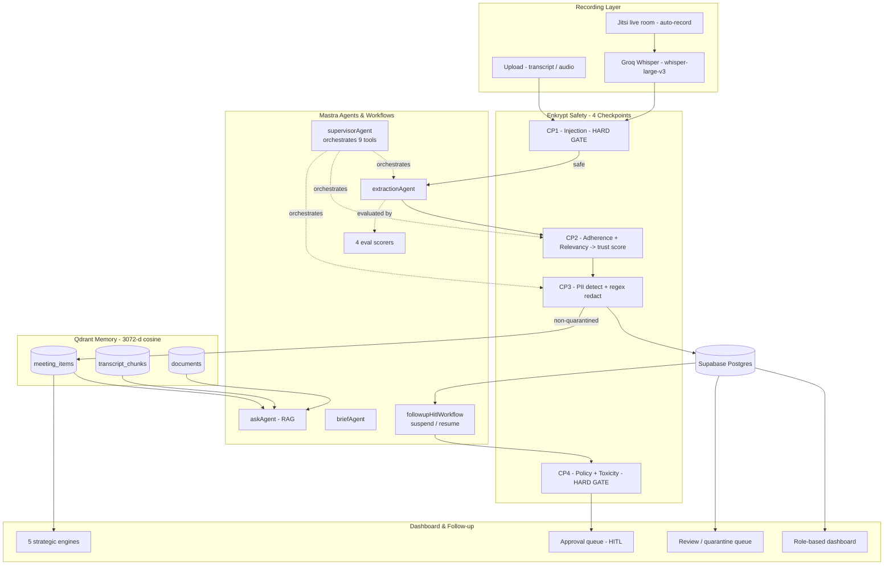

<div align="center">

# Helm

### AI Chief of Staff & Meeting Command Center

**Most meeting tools stop at the summary. Helm closes the loop:**
**extract → validate → remember → monitor → act → reason.**

[](https://mastra.ai)
[](https://qdrant.tech)
[](https://enkryptai.com)


*HiDevs × Mastra AI Agent Hackathon 2026 — Track: AI Meeting Intelligence & Action Command Center*

</div>

---

## The Problem

Teams, Zoom AI Companion, and Otter are note-takers. They give you a transcript and a summary — *what was said* — and then stop. What they never do:

- **Turn talk into tracked work.** A summary isn't a task. It has no owner you can query, no deadline you can monitor, and nobody chases it.
- **Track execution.** The moment the call ends, the tool forgets. An action item goes overdue and nobody knows until a human notices.
- **Validate their own output.** LLM summarizers hallucinate owners, invent deadlines, and confidently write "$50k budget approved" with zero provenance. There is no trust signal.
- **Reason across meetings.** A decision today that reverses one from last month sails through silently — no contradiction detection, no memory.

The value isn't in the summary. It's in everything **after** it: follow-through, trust, cross-meeting intelligence, and autonomy you can actually let loose because a human stays in the loop.

---

## Our Solution

Helm is an **AI Chief of Staff** that turns meetings into tracked, trustworthy, executed work:

```
Record  ->  Transcribe  ->  Extract  ->  Validate  ->  Remember  ->  Monitor  ->  Follow-up  ->  Strategic Intelligence
(Jitsi)    (Groq Whisper)  (Mastra)    (Enkrypt x4)   (Qdrant)     (workflow)  (HITL approval)   (5 insight engines)
```

Helm doesn't just take notes — **it chases outcomes.** Every extracted item carries a *visible trust score* earned from a 4-checkpoint Enkrypt safety pipeline. Overdue commitments are flipped to at-risk by a rule-based state machine. Follow-up nudges are drafted by an agent, policy-screened, and **suspended for human approval** before a single email goes out. And because every decision lives in Qdrant, Helm catches contradictions across meetings and answers *"why did we switch databases?"* with citations.

---

## Architecture



**Trust routing:** `> 0.85 -> auto` (dashboard) · `0.60–0.85 -> review` · `< 0.60 -> quarantine` (never embedded into Qdrant).

---

## Key Features

| Feature | What it does |
|---|---|
| **Live meeting rooms** | Jitsi rooms (`/rooms/[id]`) where the host's browser auto-records mic + shared-tab audio hands-free, with a live speaker timeline for free deterministic diarization |
| **AI extraction** | Extracts decisions, action items, deadlines, dependencies, and assignees as structured Zod-validated JSON — resolving first-person pronouns to speaker names |
| **Trust score on every item** | Enkrypt adherence (grounded in source quote?) + relevancy → a visible 0–1 trust score; fabricated claims score 0 and are quarantined |
| **4 Enkrypt safety checkpoints** | Injection · adherence/hallucination · PII · outbound policy — two are hard gates |
| **Cross-meeting memory + contradictions** | Qdrant similarity + explicit supersede resolution flag when a new decision conflicts with an older one |
| **Lifecycle state machine** | `Open → In Progress → At Risk → Blocked → Done` driven by deadline / silence / dependency rules |
| **HITL follow-up approval queue** | The follow-up workflow `suspend()`s with a drafted nudge; a manager approves/rejects to `resume()` it — nothing sends without a human tap |
| **Tiered escalation** | Tier 1 friendly nudge → assignee · Tier 2 firmer + CC the owner's manager · Tier 3 urgent flag |
| **Role-based views** | Employees get a personal task workspace; managers/VPs get team analytics, review & approval queues |
| **Real-time team chat** | Channels + DMs over Supabase Realtime (`postgres_changes` on `messages`) |
| **Calendar** | `react-big-calendar` overlaying scheduled rooms and item deadlines |
| **AI knowledge base** | Ask questions across all meeting history → cited answers `[Meeting Title]`, superseded decisions flagged |
| **Weekly reports** | 7-day rollups with per-meeting ROI scores (items produced), pushed to Slack |
| **Email notifications** | Approved follow-ups and deadline reminders delivered via Resend |

---

## Mandatory Stack Integration

> Helm ships **two Mastra surfaces**: the standalone Mastra backend (`helm`, deployed on Railway) is the full agent project — **5 agents, 5 tools, 5 workflows, 4 scorers, composite storage + observability**; the deployed Next.js app (`helm-web`, Vercel) **embeds a load-bearing subset** (6 workflows, 2 agents, 4 scorers, LibSQL store) executed directly by API routes. Everything below is registered and executed — not decorative.

### Mastra Integration — Agents · Workflows · Tools · Evals

**Registration (`Helm/src/mastra/index.ts`):** `new Mastra({ workflows, agents, tools, scorers, storage, observability, logger })` with a `MastraCompositeStore` (LibSQL default + DuckDB observability domain), `Observability` (`MastraStorageExporter` + `MastraPlatformExporter` + `SensitiveDataFilter`), and a `PinoLogger`.

#### Agents (5)

| Agent | Model | Role |
|---|---|---|
| **`supervisorAgent`** | `gemini-2.5-flash` | The **supervisor-orchestrating-specialists** pattern. Given `{ title, transcript }`, it calls **9 registered tools in a strict order** via function-calling: `runInjectionCheck → runExtraction → scoreTrustItems → redactPii → persistPipeline → detectContradictions` (+ `resolveDependencies`, `enkryptCheck`, `qdrantWrite`). Returns a structured pipeline summary. |
| **`extractionAgent`** | `gemini-2.5-flash` | Transcript → `{ items: [...] }` structured JSON; mandatory verbatim `source_quote`, omits unknown fields (no hallucinated owners). |
| **`followupAgent`** | `gemini-2.5-flash` | Drafts a tiered, 2–3 sentence follow-up nudge addressed to the owner by name. Step 1 of the HITL workflow. |
| **`askAgent`** | `gemini-2.5-flash` | RAG knowledge assistant — calls `qdrantSearch` across `meeting_items` + `transcript_chunks` + `documents`, answers **only** from results, cites `[Meeting Title]`, and **skips quarantined items**. |
| **`briefAgent`** | `gemini-2.5-flash` | Synthesizes a structured project brief (Goal / Progress / Completed / Pending / Responsibilities / Key Decisions) from the top-20 Qdrant results, with inline citations. |

> **Model note:** backend agents run on **Gemini 2.5 Flash** (`google/gemini-2.5-flash`). In the *deployed web pipeline*, text generation was migrated to **Featherless (`Qwen3-32B`)** after Gemini's free tier hit hard quota walls at deploy time — a one-line swap thanks to Mastra's provider-agnostic `Agent.model`. Gemini is retained for **embeddings + audio diarization** (a separate quota bucket).

#### Workflows (real `createWorkflow` / `createStep` graphs)

| Workflow | Steps | HITL |
|---|---|---|
| **`followupHitlWorkflow`** | `draft-nudge` → `policy-check` (Enkrypt CP4) → **`human-approval` (`suspend()` → `resume()`)** | Yes |
| **`riskMonitorWorkflow`** | `fetch-items` → `evaluate-and-apply` (dependency / deadline / silence rules → status transitions) | No |
| **`reminderWorkflow`** | `find-due-items` → `create-reminders` (24h dedup, email owners, Slack) | No |
| **`weeklyReportWorkflow`** | `aggregate-week` (ROI scores) → `notify-slack` | No |
| **`strategicInsightWorkflow`** | `seed` → 5 engine steps → `sort-signals` | No |
| **`pipelineSupervisorWorkflow`** *(helm-web)* | `extract → validate-schema → trust-score → pii-check → eval-score` | No |

**HITL, in detail:** `followupHitlWorkflow` drafts a nudge, runs the Enkrypt policy gate, then `suspend({ draft, owner, policy_passed })` and stops. `POST /api/followup/draft` persists the draft and keeps the live `Run` in memory keyed by `escalation_id`; when a manager approves at `/followups`, `POST /api/followup/resolve` calls `run.resume({ step: "human-approval", resumeData: { approved } })` on that exact run. The decision is durably recorded in `escalation_logs` either way — **nothing is sent without a human tap.**

#### Tools (5 registered `createTool`)

| Tool | Purpose |
|---|---|
| **`dependencyResolverTool`** | Embeds each `dependency_hint`, hybrid-searches Qdrant filtered by `project_id`, links matches > 0.7 into `depends_on` (never auto-links weak matches) |
| **`qdrantSearchTool`** | Multi-collection semantic search with payload filters + quarantine exclusion (used by `askAgent` / `briefAgent`) |
| **`qdrantWriteTool`** | Embeds + upserts items to Qdrant with a full metadata payload |
| **`enkryptCheckTool`** | Wraps Enkrypt guardrail calls (adherence / relevancy / injection / policy) |
| **`piiRedactorTool`** | Detects (Enkrypt) + regex-redacts PII before storage |

*(The supervisor also composes inline tools: `runInjectionCheck`, `runExtraction`, `scoreTrustItems`, `persistPipeline`, `detectContradictions`. Transcription is handled by a Groq route, not a Mastra tool.)*

#### Evals / Scorers (4 deterministic `createScorer`)

`itemCountScorer` · `ownerAccuracyScorer` · `typeAccuracyScorer` · `sourceQuotePresenceScorer` — each a `.preprocess → .generateScore → .generateReason` pipeline that emits an explainable reason (*"2/3 owners correct. Missing: Priya on…"*). They run **live in the ingestion pipeline** on every extraction and on demand via `POST /api/evals/run` against a golden transcript.

#### Observability

Backend: Mastra `Observability` with storage + platform exporters and a `SensitiveDataFilter`, persisted to DuckDB. Web app: an OpenTelemetry-style `withLLMTrace` wrapper records model, latency, tokens, prompt **hash** (never raw prompts), and status for every LLM call — surfaced at `/observability`.

---

### Qdrant Integration

Qdrant is Helm's **long-term semantic memory** — the substrate for search, cited Q&A, dependency linking, contradiction detection, and two strategic engines. We use `@mastra/qdrant` (`QdrantVector`) for upserts/collection management **and** raw Qdrant REST for payload-filtered search the SDK doesn't expose.

**Collections (3 · all 3072-d cosine, `gemini-embedding-001`):**

| Collection | Payload | Purpose |
|---|---|---|
| **`meeting_items`** | `item_id, text, type, project_id, meeting_id, owner, trust_score, review_state, meeting_title, supersedes_hint` | Dependency resolution, contradiction detection, cross-project matching |
| **`transcript_chunks`** | `chunk_text, meeting_id, meeting_title, chunk_index, start_time, end_time, project_id` | Fine-grained "time-travel" search + source citations |
| **`documents`** | `chunk_text, document_name, project_id` | RAG over uploaded project docs |

**How it's used:**

- **Hybrid search** — vector similarity + payload filters. Dependency resolution filters `must: project_id`; search excludes `must_not: review_state == "quarantined"`. Falls back gracefully when a keyword index isn't built yet (`400 Index required → unfiltered + JS post-filter`; `404 → []`).
- **Cross-meeting contradiction detection** — each new decision is embedded and searched; a **> 0.85**-similar decision from a *different* meeting is written to the `contradictions` table. Explicit `supersedes_hint` phrases are embedded and matched to the overturned decision.
- **Dependency resolution** — `dependency_hints` embedded + searched (filtered by project); matches **> 0.7** populate `depends_on`, which the risk monitor then uses for the "blocked" rule.
- **RAG for the ask agent** — one query embedding fans out across all 3 collections; the assistant answers only from results with `[Meeting Title]` citations and refuses to fabricate.
- **Semantic dedup / cross-project** — the `cross-project` insight engine finds **> 0.88** parallels in other projects' decisions; the `recurring-blocker` engine clusters dependency-hint embeddings at **> 0.8** cosine.
- **Quarantine invariant** — low-trust (`quarantined`) items are written to Postgres for human triage but **never embedded**, so a hallucination can't surface in search or citations.

---

### Enkrypt AI Integration

Enkrypt is Helm's **safety spine** — four checkpoints wrapping the pipeline end to end, two of them hard gates. Base `https://api.enkryptai.com`; the helper surfaces the full error body (not just status) so detector-config errors are debuggable.

| # | Checkpoint | Detector / endpoint | On flag |
|---|---|---|---|
| **1** | **Prompt injection** | `injection_attack` → `/guardrails/detect`, on the **raw transcript before any LLM** | **HARD GATE** — HTTP 400, pipeline halts |
| **2** | **Adherence + Hallucination** | `/guardrails/adherence` + `/guardrails/relevancy`, per item | → trust score → 3-tier routing |
| **3** | **PII** | `pii` (+ explicit `entities`) → `/guardrails/detect` | Detect + regex-redact **before** storage |
| **4** | **Policy / Relevancy** | `policy_violation` (+ `policy_text`) + `toxicity` on follow-up drafts | **HARD GATE** — HTTP 422, draft blocked |

**Trust score computation & 3-tier routing** (`scoreTrustItems`):

```ts
const trust_score = !adherent ? 0.0        // hallucination -> quarantine
  : relevant ? 0.9                          // grounded + on-topic -> auto (dashboard)
  : hasFinancialClaim ? 0.4                 // adherent, off-topic, $ figure -> quarantine
  : 0.7;                                     // adherent, off-topic -> review
const review_state = trust_score >= 0.85 ? "auto"
  : trust_score >= 0.60 ? "pending_review" : "quarantined";
```

The signature demo case: a fabricated **"$50k budget approved"** with no grounding scores `adherence 0 → 0.0 → quarantined`, lands in the review queue (red band), and is **absent from search**. Real per-check scores are stored in each item's `enkrypt_checks` JSON and surfaced as colored trust badges throughout the UI.

**Fallback mechanisms (documented, not hidden):**
- Enkrypt's **PII detector 400s** without an explicit `entities` list (`"Missing pii.entities"`). We send the entity list; if the call still fails, a **deterministic regex redactor** (PAN, card, Aadhaar, email, phone) is the fail-safe — it fails *safe*, not open, and runs before any data reaches Supabase or Qdrant.
- The policy check (**CP4**) **fails closed** — if Enkrypt is unreachable, `policy_passed = false`, so a human still reviews. The toxicity response is an array (`[] = clean`), handled correctly.

---

## Tech Stack

| Layer | Technology |
|---|---|
| **Frontend** | Next.js 16 (App Router) · TypeScript · Tailwind CSS v4 · lucide-react · recharts · react-big-calendar · @dnd-kit · @jitsi/react-sdk |
| **Agent Runtime** | Mastra (`@mastra/core`, `@mastra/libsql`, `@mastra/qdrant`, `@mastra/duckdb`, `@mastra/observability`) · Node.js |
| **AI** | Google **Gemini 2.5 Flash** (backend agents) · **Featherless Qwen3-32B** (deployed web generation) · **Gemini `gemini-embedding-001`** 3072-d embeddings · **Groq `whisper-large-v3`** transcription |
| **Database** | Supabase — Postgres + Realtime + Auth |
| **Vector DB** | Qdrant Cloud (3 collections, 3072-d cosine) |
| **Safety** | Enkrypt AI Guardrails (4 checkpoints) |
| **Email / Notify** | Resend · Slack webhooks |
| **Deployment** | Vercel (web) + Railway (Mastra backend) |

*Everything runs on free tiers / open source — no credit cards.*

---

## Project Structure

```
Helm/
├── helm-web/                        # Next.js 16 full-stack app  (Vercel)
│   ├── app/
│   │   ├── (auth)/                  # login / signup (Supabase Auth)
│   │   ├── api/                     # ~70 route handlers (pipeline, search, followup, chat, rooms...)
│   │   ├── page.tsx  items/ decisions/ meetings/ review/ followups/
│   │   ├── search/ chat/ calendar/ team/ reports/ rooms/ observability/ settings/
│   │   └── components/              # UI (Sidebar, Kanban, Trust badges, chat, calendar...)
│   ├── lib/
│   │   ├── mastra/                  # EMBEDDED Mastra runtime
│   │   │   ├── index.ts             #   Mastra({ 6 workflows, 2 agents, 4 scorers, LibSQL })
│   │   │   ├── agents/              #   extraction-agent, followup-agent
│   │   │   ├── workflows/           #   followup-hitl, risk-monitor, reminder,
│   │   │   │                        #   weekly-report, strategic-insight, pipeline-supervisor
│   │   │   ├── scorers/             #   4 deterministic eval scorers
│   │   │   └── schemas/             #   shared Zod item schema
│   │   ├── model.ts  security.ts  observability.ts  mailer.ts  diarize.ts
│   └── package.json
│
└── Helm/  (helm-mastra)             # Standalone Mastra backend  (Railway)
    └── src/mastra/
        ├── index.ts                 # Mastra({ 5 agents, 5 tools, 5 workflows, 4 scorers,
        │                            #          CompositeStore + Observability + Pino })
        ├── agents/                  # supervisor · extraction · followup · ask · brief
        ├── tools/                   # dependency-resolver · qdrant-search · qdrant-write
        │                            # · enkrypt-check · pii-redactor
        ├── workflows/               # risk-monitor · followup-hitl · reminder
        │                            # · weekly-report · strategic-insight
        ├── scorers/                 # extraction-scorer (4)
        └── schemas/                 # item.schema.ts
```

---

## Screenshots / Demo

> **Demo video:** `<add-link>`   ·   **Live:** https://helm-gray.vercel.app

| Screen | Shows |
|---|---|
| **Dashboard** | *(screenshot)* Trust-scored action items sorted blocked → at-risk → open, strategic signals, approval-queue widget |
| **Review Queue** | *(screenshot)* The quarantined `$50k` hallucination with its source-quote diff |
| **Approval Queue** | *(screenshot)* A tiered follow-up draft with the Enkrypt "policy passed" badge and **Approve & send** |
| **Ask** | *(screenshot)* *"Why did we switch databases?"* → cited answer noting the superseded MongoDB decision |
| **Live Room** | *(screenshot)* Jitsi room recording, ends → auto-transcribes → items appear |
| **Team / Reports** | *(screenshot)* Manager team-status table + weekly report with meeting-ROI badges |

---

## Getting Started

```bash
# 1 - Frontend (Next.js full-stack app, includes embedded Mastra)
cd helm-web
npm install
cp .env.example .env.local      # fill in the values (see below)
npm run dev                     # -> http://localhost:3000

# 2 - (optional) Standalone Mastra backend + playground
cd ../Helm
npm install
cp .env.example .env            # backend uses SUPABASE_URL (no NEXT_PUBLIC_ prefix)
npm run dev                     # -> Mastra dev playground

# 3 - One-time DB setup: GET /api/setup-db returns idempotent SQL
#     to paste into the Supabase SQL Editor (creates the extended tables).
```

---

## Environment Variables

**`helm-web/.env.local`** (frontend + embedded Mastra):

```bash
NEXT_PUBLIC_SUPABASE_URL=          # Supabase project URL
NEXT_PUBLIC_SUPABASE_ANON_KEY=     # anon key (client)
SUPABASE_SERVICE_ROLE_KEY=         # service-role key (server routes)
NEXT_PUBLIC_SITE_URL=              # canonical origin for auth email links (prod)
QDRANT_URL=                        # Qdrant Cloud endpoint
QDRANT_API_KEY=                    # Qdrant API key
QDRANT_COLLECTION=                 # items collection (default meeting_items)
GOOGLE_GENERATIVE_AI_API_KEY=      # Gemini embeddings + audio diarization
FEATHERLESS_API_KEY=               # text generation (Qwen3-32B)
FEATHERLESS_MODEL=                 # e.g. Qwen/Qwen3-32B
GROQ_API_KEY=                      # Whisper transcription
ENKRYPT_API_KEY=                   # 4 safety checkpoints
RESEND_API_KEY=                    # email delivery (optional -> console fallback)
RESEND_FROM=                       # verified sender (optional)
SLACK_WEBHOOK_URL=                 # reminder / report digests (optional)
NEXT_PUBLIC_JITSI_DOMAIN=          # meeting host (default meet.jit.si)
```

**`Helm/.env`** (standalone Mastra backend) uses **non-prefixed** `SUPABASE_URL` / `SUPABASE_ANON_KEY` plus `GOOGLE_GENERATIVE_AI_API_KEY`, `QDRANT_*`, `ENKRYPT_API_KEY`, `GROQ_API_KEY`, `SLACK_WEBHOOK_URL`.

---

## Live Deployment

| Surface | URL |
|---|---|
| **Frontend (Next.js + embedded Mastra)** | https://helm-gray.vercel.app |
| **Mastra Backend (playground / observability)** | https://hidevs-production.up.railway.app |
| **Database** | Supabase Cloud (Postgres + Realtime + Auth) |
| **Vector DB** | Qdrant Cloud |

---

## Team

A **2-person team** competing in the **HiDevs × Mastra AI Agent Hackathon 2026 Finale** — India's first TypeScript-only AI agent hackathon.

- **Member 1** — Backend, AI pipeline, Mastra agents/workflows/tools, database
- **Member 2** — Frontend, UI/UX, role-based experience

---

## Hackathon Context

Built for the **"AI Meeting Intelligence & Action Command Center"** track of the HiDevs × Mastra AI Agent Hackathon 2026, judged by engineers from **Mastra, Qdrant, and Enkrypt AI**. Helm was designed to maximize the three weighted integration criteria — **Mastra depth (agents · workflows · tools · evals · HITL), Qdrant quality (multi-collection hybrid search · contradiction detection · RAG), and Enkrypt coverage (4 checkpoints · trust tiers · quarantine)** — while proving real problem impact: *closing the loop between what a meeting decides and what actually gets done, safely.*

<div align="center">

**Helm — turning meetings into tracked, trustworthy, executed work.**
Built on Mastra · Qdrant · Enkrypt AI

</div>
